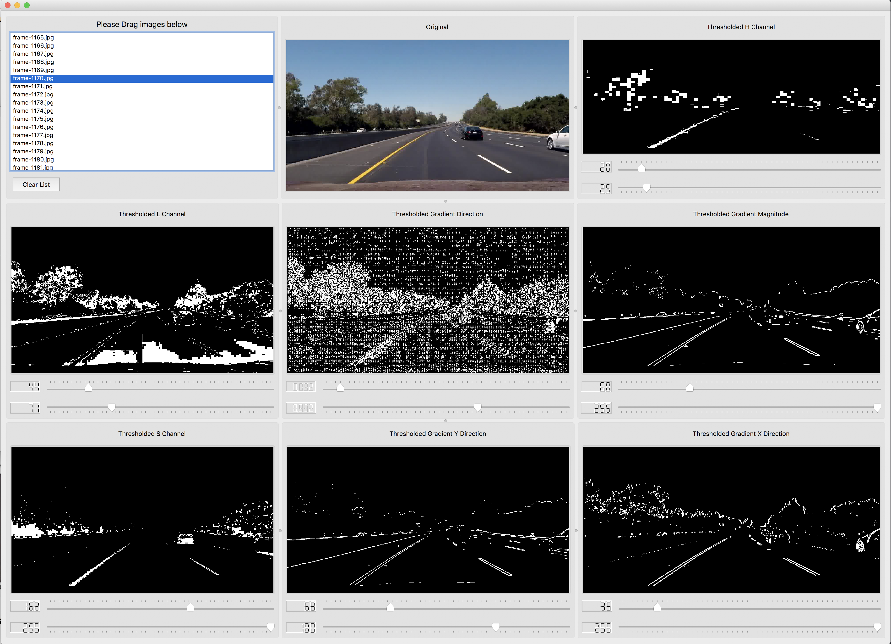
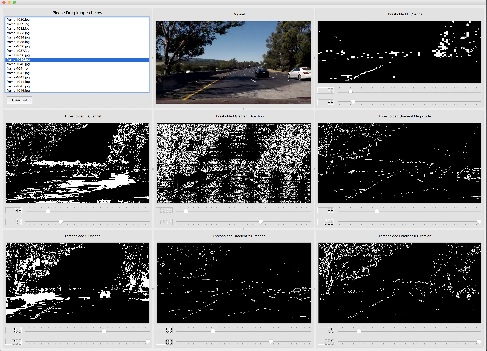
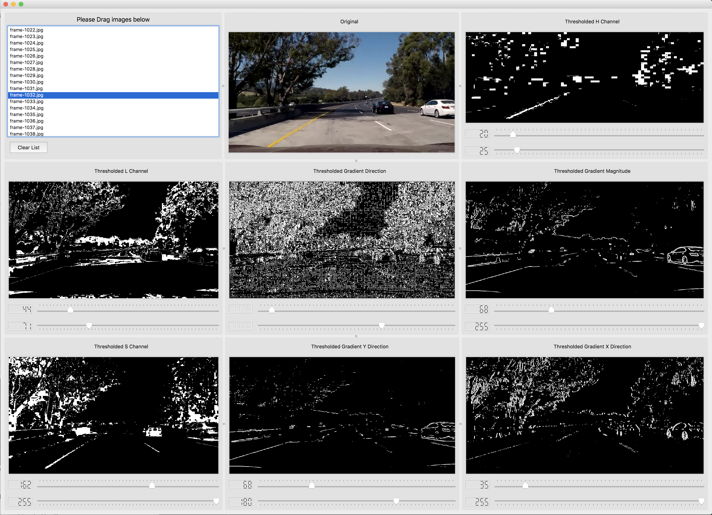
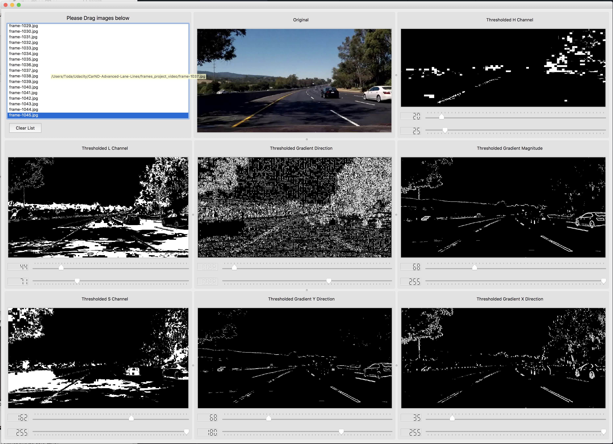
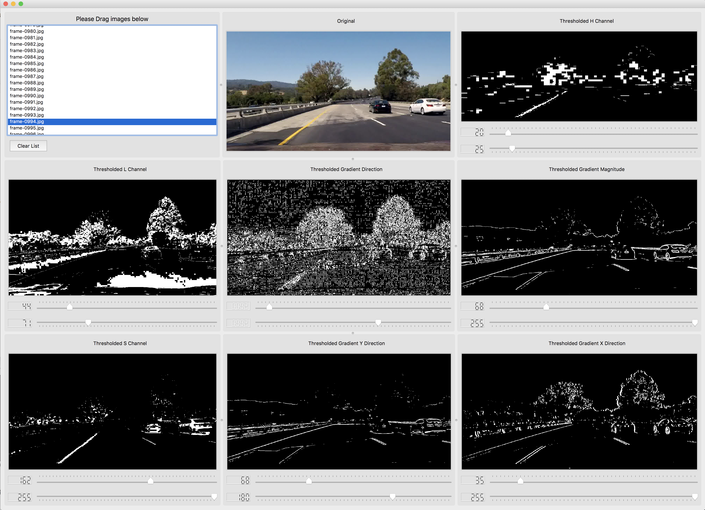
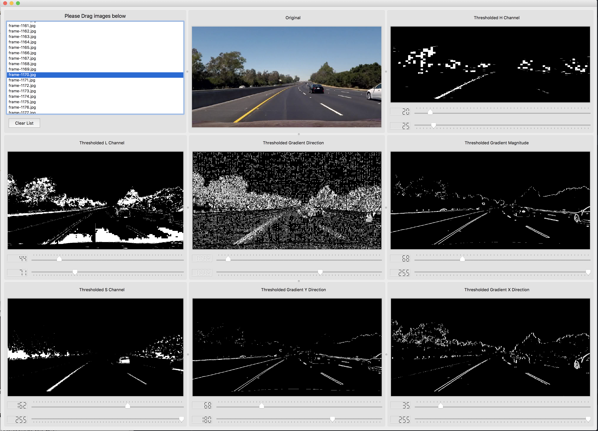

# ImageFilter
Handy tool to filter single colour channels (H, S, L), gradient in x and y directions, gradient magnitude, combined gradient direction for coloured images.

Build with origami in mind. You can fold filters, remove and adapt the UI as you like. 

## Requirements
- Python 3
- PyQt5

## Usage
```
cd ImageFilter
python -m Filter
```

Here are some examples:

#### Example 1


#### Example 2


#### Example 3


#### Example 4


#### Example 5


#### Example 6



